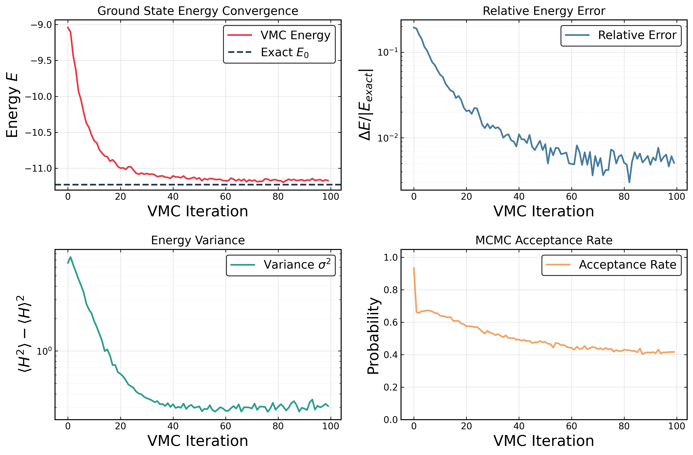
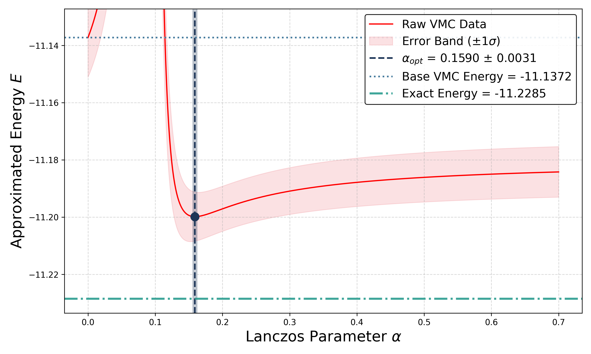
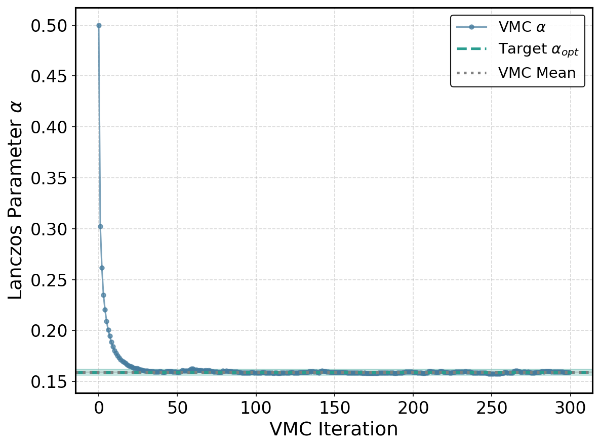
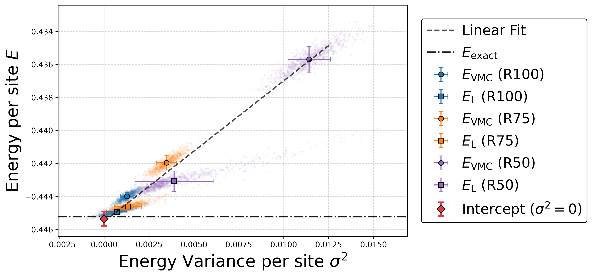

# Neural Network Quantum States enhanced by the Lanczos step

This project provides a robust numerical framework to study the ground-state properties of the **Heisenberg model** using **Variational Monte Carlo (VMC)** augmented by **Lanczos (Krylov) subspace projection**. It allows for the estimation of ground-state energies and low-energy excitations with high precision, using a zero-variance extrapolation technique. This repository contains the complete computational pipeline supporting the results presented in the report: "[Neural Network Quantum States enhanced by the Lanczos step](./report.pdf)".

## 🚀 Features

Voici une proposition de section "Features" parfaite pour ton `README.md` sur GitHub, construite à partir des méthodes détaillées dans ton rapport et intégrant les graphiques que nous avons travaillés ensemble.

## 🚀 Features

* **Variational Optimization (VMC):** Implementation of Restricted Boltzmann Machine (RBM) based neural quantum states (NQS) using [NetKet](https://www.netket.org/) to capture ground-state properties, optimized via Stochastic Reconfiguration (SR).

<div align="center">
  
</div>

* **Lanczos Ansatz (Krylov Filtering):** Application of a single-step Lanczos projection to systematically improve initial variational wavefunctions and mitigate intrinsic biases.

* **Stochastic Reweighting:** Efficient reconstruction of the continuous energy landscape $E_L(\alpha)$ using pre-calculated local moments, avoiding the need for new, computationally expensive MCMC simulations.

<div align="center">
  
</div>


* **Moving-Average Bootstrap & SGD:** Robust explicit optimization of the Lanczos parameter $\alpha$ via Moving-Average Bootstrap and Stochastic Gradient Descent to securely bypass noisy local minima and sharp energy barriers.

<div align="center">
  
</div>

* **Orthogonalized Krylov Subspace:** Exact diagonalization within a 2-dimensional refined basis to stably evaluate the exact Lanczos energy, effectively avoiding catastrophic cancellation inherent to raw moment evaluation.

* **Zero-Variance Extrapolation:** Linear extrapolation combining expected energy and statistical variance to reliably estimate the exact theoretical ground-state energy ($E_{\mathrm{exact}}$).

<div align="center">
  
</div>

## 📂 Project Structure

```text
├── datas/              # Simulation logs and result files
├── notebook/           # Jupyter notebooks for interactive analysis
├── assets/             # plots 
├── src/
│   ├── lancoz_alpha_opt.py  # Lanczos ansatz logic
│   ├── ener_landscape.py    # Energy landscape analysis
│   └── plot/                # Visualization scripts
└── requirements.txt         # Dependencies

```

## 🛠 Prerequisites

Ensure you have [Conda](https://docs.conda.io/) or `venv` installed.

```bash
# Clone the repository
git clone https://github.com/victor-pcll/Lanczos-Algorithm-Ground-State-Heisenberg-model.git
cd Lanczos-Algorithm-Ground-State-Heisenberg-model

# Install dependencies
pip install -r requirements.txt

```

## 📝 License

This project is open-source and available under the [MIT License](https://www.google.com/search?q=LICENSE).

---

*Developed as part of the Master's project at EPFL.*