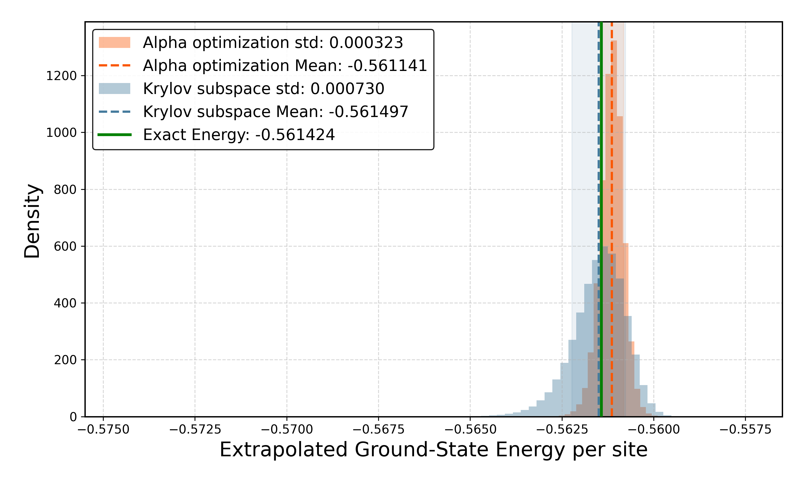

# Lanczos Algorithm for the Heisenberg Model

This project provides a robust numerical framework to study the ground-state properties of the **Heisenberg model** using **Variational Monte Carlo (VMC)** augmented by **Lanczos (Krylov) subspace projection**. It allows for the estimation of ground-state energies and low-energy excitations with high precision, using a zero-variance extrapolation technique. This repository contains the complete computational pipeline supporting the results presented in the report: "Lanczos Algorithm for the Heisenberg Model."

## 🚀 Features

* **Variational Optimization:** Implementation of RBM-based neural quantum states using [NetKet](https://www.netket.org/).
* **Lanczos Ansatz:** Post-processing optimization to improve initial variational wavefunctions.

<div align="center">
  
</div>

## 📂 Project Structure

```text
├── datas/              # Simulation logs and result files
├── notebook/           # Jupyter notebooks for interactive analysis
├── assets/             # plots 
├── src/
│   ├── lancoz_alpha_opt.py  # Lanczos ansatz logic
│   ├── ener_landscape.py    # Energy landscape analysis
│   └── plot/                # Visualization scripts
└── requirements.txt         # Dependencies

```

## 🛠 Prerequisites

Ensure you have [Conda](https://docs.conda.io/) or `venv` installed.

```bash
# Clone the repository
git clone https://github.com/victor-pcll/Lanczos-Algorithm-Ground-State-Heisenberg-model.git
cd Lanczos-Algorithm-Ground-State-Heisenberg-model

# Install dependencies
pip install -r requirements.txt

```

## 📝 License

This project is open-source and available under the [MIT License](https://www.google.com/search?q=LICENSE).

---

*Developed as part of the Master's project at EPFL.*